# Self-Guided-Network-for-Fast-Image-Denoising

The PyTorch implementation of SGN, and the estimation PSNR of given noise range

## 1 Demo: trained SGN on ILSVRC2012 validation set (mu = 0, sigma = 30) (1000000 iterations)

left: clean image  (selected from COCO2014 validation set COCO_val2014_000000264615.jpg)

middle: additive Gaussian noise + clean image

right: denoised image using trained SGN

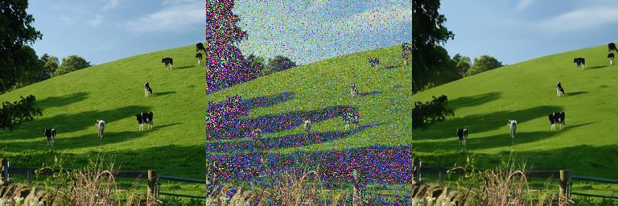

## 2 Noise Estimate

zero mean Gaussian noise

| standard deviation in [0, 1] | 0.1 | 0.075 | 0.05 | 0.04 | 0.03 | 0.02 | 0.01 | 0.00075 | 0.0005 | 0.0001 |
| :----- | :-----: | :-----: | :-----: | :-----: | :-----: | :-----: | :-----: | :-----: | :-----: | :-----: |
| standard deviation in [0, 255] | 25.5 | 19.125 | 12.75 | 10.2 | 7.65 | 5.1 | 2.55 | 1.9125 | 1.275 | 0.0255 |
| average PSNR | 20.00 | 22.46 | 26.00 | 27.95 | 30.47 | 33.98 | 40.00 | 42.49 | 46.00 | 60.00 |

## 3 Noise Examples

There are some examples, corresponding to specific noise standard deviation.

### Standard Deviation = 0.3

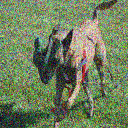

### Standard Deviation = 0.2

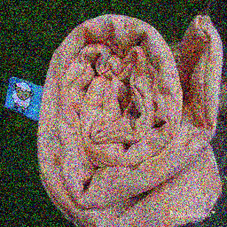

### Standard Deviation = 0.18

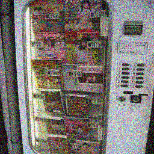

### Standard Deviation = 0.15

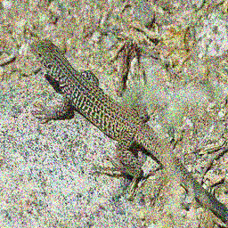

### Standard Deviation = 0.12

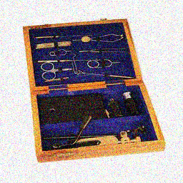

### Standard Deviation = 0.1

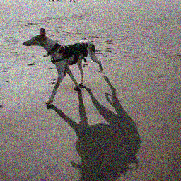

### Standard Deviation = 0.075

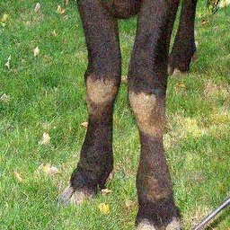

### Standard Deviation = 0.05

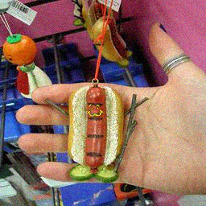

### Standard Deviation = 0.04

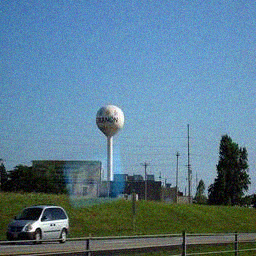

### Standard Deviation = 0.03

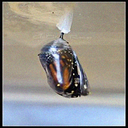

### Standard Deviation = 0.02

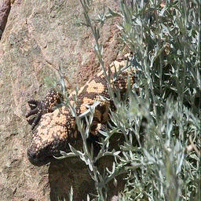

### Standard Deviation = 0.01

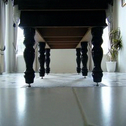

### Standard Deviation = 0.0075

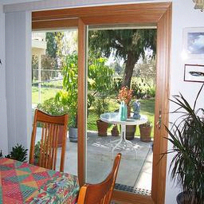

### Standard Deviation = 0.005

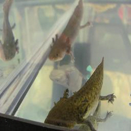

### Standard Deviation = 0.001

